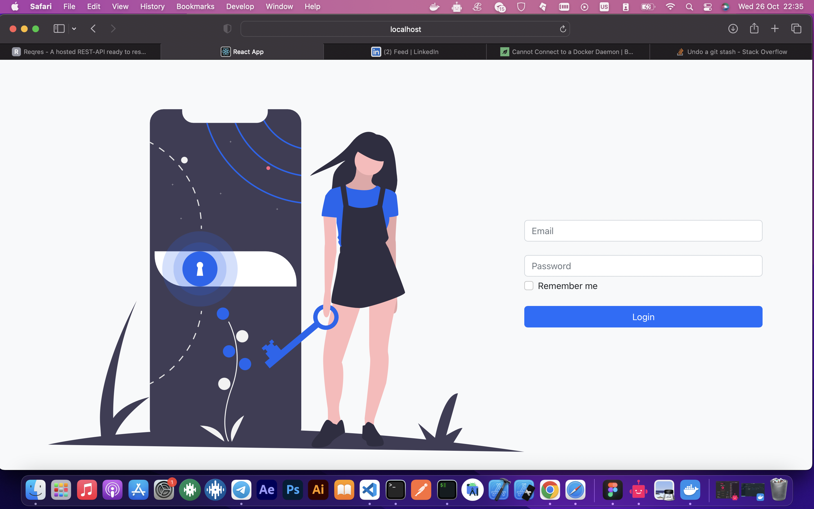

# Floward Frontend Assignment

The goal of this project is to use ReactJS capabilities and its paradigms by creating a simple web application with 3 screens

1. Login Page (the route can be /login)
1. Country Listing Page (Index page. Should be authenticated to view this page and if not
   authenticated, redirect to login page)
1. Country Details Page (/details/:alphaCode Should be authenticated to view this page
   and if not authenticated, redirect to login page)

- Here the param alphaCode is cca3 field in the API response

## Requirements

1. You need to use React Router for routing
2. You need to use global app state of your choice, like Redux or Context API (Redux is
   preferred) to keep customer authentication status
3. Add a header navigation bar which is only visible once user is authenticated
   b. A Link to index page that will be country listing page route
   c. Add Button for Logout in the header bar and click action should remove
   localstorage token and set user as non authenticated and redirect to login page.
4. You must follow React best practices and the latest standards when building the app
   and also consider this as a production application and take care for performance
   optimization similar to how you would work for a real world application
5. Feel free to use any css library if needed for styling and you can build your own UI for the
   pages and components. Make sure it is presentable UI with some basic styling atleast.
   (Using tailwind is also a plus)
6. Publish the code to GitHub public repo and provide us the link
7. Containerize the entire application with Docker file and add this to the repo source code

# Project Results

### PROJECT LINK

- https://floward-assignment.netlify.app

# Getting Started

### Dependencies

- please install all the dependencies using npm install

### Installing

- clone this repository by using git clone https://github.com/judinilson/floward_frontend_assignment.git
- then cd/floward_assignment folder then install the dependencies

### Executing program

- To run it use the following command npm start
